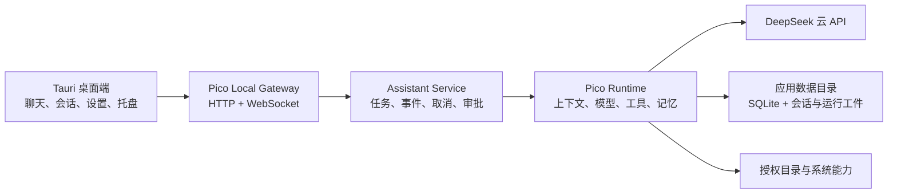

# Pico 桌面版个人助手：实现方案与第一阶段目标

## 1. 文档目的

本文档描述如何在保留 Pico 现有 Python Agent Runtime 的基础上，把当前终端版 coding agent 改造成一个供个人使用的 macOS 桌面助手，并定义第一阶段的范围、实施顺序和验收标准。

第一阶段只接入 DeepSeek 云 API，不内置或管理 Ollama、本地模型和模型下载功能。桌面应用优先支持 macOS；架构保留以后支持 Windows 的可能，但不把跨平台发布作为第一阶段验收条件。

## 2. 产品定位

Pico 桌面版不是一个只有聊天界面的模型客户端，而是一个本地优先、权限透明、能够在用户明确授权的目录中完成实际任务的个人助手。

第一版应形成一条完整闭环：

> 用户从桌面窗口发起任务 → Pico 实时返回进度 → 需要时申请工具权限 → 用户批准或拒绝 → Pico 执行工具并展示结果 → 会话和个人记忆被安全保存。

## 3. 已有基础与需要改造的部分

### 3.1 可以直接复用

当前 Pico 已经具备以下核心能力：

- DeepSeek Anthropic-compatible Messages API 接入；
- 多步 Agent 控制循环；
- 文件读取、搜索、写入、补丁和 Shell 等受约束工具；
- 风险工具审批模式；
- 工作区路径边界、敏感环境变量过滤和运行记录脱敏；
- 会话保存、恢复、检查点和运行工件；
- 工作记忆和长期记忆；
- 对 Runtime、工具和安全边界的测试。

这些能力继续作为唯一的 Agent 内核。CLI 和桌面端都调用同一套 Application Service，避免出现两套行为不同的 Agent。

### 3.2 第一阶段必须改造

当前 `Pico.ask()` 是同步调用，Provider 也只返回完整响应。桌面应用需要增加：

- 流式文本和运行事件；
- 运行中的停止与取消；
- 可暂停的异步工具审批；
- 桌面端可订阅的稳定事件协议；
- 不依赖终端 `input()` 的审批接口；
- 统一的应用数据目录；
- 多会话的查询、创建、重命名和恢复接口；
- 用户授权目录及其读写权限模型。

## 4. 技术方案

### 4.1 总体架构



### 4.2 桌面端

建议使用 Tauri 2 + React + TypeScript：

- Tauri 负责窗口、托盘、全局快捷键、系统对话框和应用打包；
- React 负责聊天界面、会话列表、设置、工具卡片和审批弹窗；
- 桌面端不直接持有 Agent 业务逻辑；
- 桌面端通过本机 Gateway 调用 Python Runtime；
- Python 后端最终打包成 sidecar，随 `.app` 一起启动和退出。

第一阶段开发期可以分别启动前端和 Python Gateway；完成闭环后再处理 sidecar 打包，避免打包问题阻塞核心功能开发。

### 4.3 本地 Gateway

建议新增 FastAPI Gateway，并只监听回环地址：

```text
127.0.0.1:<dynamic-port>
```

Gateway 提供两类接口：

- HTTP：会话、设置、授权目录、个人记忆和健康检查；
- WebSocket：运行事件、文本增量、工具状态、审批请求和取消结果。

桌面进程启动 Gateway 时生成一次性连接令牌，并通过进程参数或标准输入传递。所有请求都验证令牌，避免同一台机器上的其他网页或进程直接调用有本地文件权限的 Agent。

建议的初始接口如下：

```text
GET    /health
GET    /sessions
POST   /sessions
PATCH  /sessions/{session_id}
GET    /sessions/{session_id}
POST   /runs
POST   /runs/{run_id}/cancel
POST   /runs/{run_id}/approvals/{approval_id}
GET    /settings
PATCH  /settings
GET    /grants
POST   /grants
DELETE /grants/{grant_id}
GET    /memories
PATCH  /memories/{memory_id}
DELETE /memories/{memory_id}
WS     /events
```

### 4.4 Application Service 与事件协议

在 `Pico` Runtime 和 Gateway 之间增加 `AssistantService`。它负责：

- 创建和恢复会话；
- 为每次请求创建可取消的 Run；
- 把 Runtime 内部进度转换为稳定事件；
- 等待并处理用户审批；
- 保证同一会话同一时刻只有一个写入型任务；
- 在异常、取消和应用退出时写入一致的最终状态。

第一阶段至少定义这些事件：

```text
run.started
message.delta
message.completed
tool.requested
tool.approval_required
tool.started
tool.output
tool.completed
tool.failed
run.cancel_requested
run.cancelled
run.completed
run.failed
```

每个事件至少包含：

```json
{
  "event_id": "...",
  "event_type": "tool.started",
  "run_id": "...",
  "session_id": "...",
  "sequence": 12,
  "created_at": "...",
  "payload": {}
}
```

`sequence` 用于断线重连后的排序和补发。桌面端只能依据公开事件协议渲染，不依赖 Runtime 内部对象。

### 4.5 DeepSeek 云 API

第一阶段固定使用现有 DeepSeek Anthropic-compatible Provider：

- 默认 endpoint：`https://api.deepseek.com/anthropic`；
- 默认模型沿用项目当前配置；
- 设置页面允许填写 API Key、endpoint、模型名和超时时间；
- 不显示 Ollama、本地模型下载和本地推理入口；
- API Key 不写入 SQLite、会话 JSON、日志或 `.env`；
- macOS 使用 Keychain 保存 API Key；
- Gateway 启动时由桌面壳读取 Keychain，并通过受控方式交给 Provider；
- 日志和错误只显示 Key 是否已配置，不回显 Key 内容。

DeepSeek Provider 需要增加真正的增量读取能力。Provider 把上游文本增量交给 Runtime，Runtime 再发出 `message.delta`，而不是等完整 HTTP 响应结束后模拟逐字显示。

### 4.6 统一数据目录

桌面版不应继续把所有数据默认写在当前仓库的 `.pico/` 中。macOS 第一阶段使用：

```text
~/Library/Application Support/Pico/
```

建议结构：

```text
Pico/
  pico.db
  sessions/
  runs/
  memory/
  attachments/
  logs/
```

SQLite 保存会话索引、消息索引、设置、授权目录、审批规则和记忆元数据。现有 JSON 会话与 run 工件第一阶段可以继续作为事实来源，SQLite 只承担桌面查询索引；在稳定后再决定是否完全迁移到 SQLite。

### 4.7 授权目录与工具边界

第一阶段通过系统目录选择器添加授权目录，不允许模型自行扩大访问范围。

每条授权记录至少包括：

```json
{
  "path": "/Users/name/Documents/Notes",
  "read": true,
  "write": false,
  "shell": false
}
```

执行工具时同时检查：

1. 工具是否在本次运行允许列表中；
2. 目标路径是否位于授权目录中；
3. 授权目录是否允许相应读写操作；
4. 当前审批规则是否允许此次具体动作。

目录授权和单次工具审批是两层不同的控制。目录可读不代表 Shell 自动获批，目录可写也不代表所有写入都永久允许。

### 4.8 工具卡片与审批规则

每次工具调用在聊天流中显示独立卡片，至少包含：

- 工具名称；
- 经过脱敏的参数；
- 风险等级；
- 等待审批、执行中、成功、失败或取消状态；
- 输出摘要；
- 受影响文件；
- 文件变化摘要。

风险操作弹窗提供：

- **本次允许**：只批准当前 `approval_id`；
- **始终允许**：保存一条范围明确的规则；
- **拒绝**：拒绝当前调用并把结果交还 Agent。

“始终允许”不能只按工具名保存。例如，允许读取某个目录不等于允许读取所有目录。规则至少应绑定工具、操作类型和路径范围。第一阶段不为任意 Shell 命令提供无条件的“始终允许”。

### 4.9 取消语义

停止生成和取消工具执行是两个不同动作：

- 模型生成：关闭上游 HTTP 流并将 Run 标记为 `cancelled`；
- Python 内部工具：设置取消令牌，在安全检查点停止；
- Shell 工具：使用独立进程组，先发送正常终止信号，超时后再强制终止；
- 已经完成的文件写入不自动回滚，但必须展示实际受影响文件；
- 应用退出时先请求取消活跃 Run，再停止 Gateway。

### 4.10 个人记忆

第一阶段的个人记忆只覆盖少量、可见、可编辑的稳定信息：

- 姓名或称呼；
- 语言和回答风格偏好；
- 常用授权目录；
- 长期决定；
- 用户明确要求“记住”的内容。

每条长期记忆必须包含内容、类别、创建时间、来源会话和更新时间，并能在设置页面查看、修改和删除。模型不得把 API Key、密码、Token 或疑似密钥文本写入长期记忆。

第一阶段不做自动扫描整个磁盘、向量数据库和大规模个人文档 RAG。

## 5. 第一阶段目标

### 5.1 阶段目标

交付一个可在 macOS 上双击启动的 Pico 桌面应用。用户配置 DeepSeek API Key 后，可以创建和恢复会话，在明确授权的目录中与 Pico 对话、查看实时回复和工具执行过程、审批风险操作，并随时停止当前任务。

### 5.2 第一阶段范围

#### 包含

- Tauri 桌面窗口；
- DeepSeek 云 API 配置及 Keychain 存储；
- 实时文本输出；
- 会话新建、列表、重命名和恢复；
- 授权文件夹的添加、查看和移除；
- 工具调用卡片；
- 本次允许、范围化始终允许和拒绝；
- 停止生成和取消运行；
- Markdown、代码块和本地文件附件显示；
- 可查看和编辑的统一个人记忆；
- 系统托盘和全局快捷键呼出主窗口；
- macOS `.app` 开发构建；
- CLI 现有行为保持可用。

#### 不包含

- Ollama 和其他本地模型；
- 内置模型下载和推理管理；
- Windows/Linux 安装包；
- 自动鼠标键盘控制和屏幕视觉操作；
- 日历、邮件、微信、飞书等外部连接器；
- 定时任务和主动通知；
- 多 Agent 编排；
- MCP 插件市场；
- 语音唤醒和持续录音；
- 全盘索引、Embedding 和向量数据库；
- 云端同步、多用户和远程访问。

### 5.3 验收标准

第一阶段完成必须同时满足以下条件：

- [ ] 首次启动能完成 DeepSeek API Key 配置，并成功进行一次真实对话；
- [ ] API Key 在 Keychain 中保存，数据库、日志和运行工件中不存在明文 Key；
- [ ] 回复内容在 DeepSeek 返回增量时实时显示，而不是等待完整回答；
- [ ] 用户可以新建、重命名并恢复至少 20 个历史会话；
- [ ] 未授权目录不能被文件工具读取或写入，符号链接不能绕过目录边界；
- [ ] 风险工具执行前出现可操作的审批弹窗；
- [ ] “始终允许”规则受工具和路径范围约束，且可以在设置中撤销；
- [ ] 工具卡片能显示参数、状态、输出摘要、受影响文件和变化结果；
- [ ] 用户可以停止模型生成，并能取消仍在运行的 Shell 工具；
- [ ] 取消或失败后会话保持可恢复，不出现永久“运行中”的僵尸状态；
- [ ] Markdown、代码块和文件附件在聊天中正确显示；
- [ ] 用户可以查看、修改和删除个人长期记忆；
- [ ] 托盘图标和全局快捷键可以显示或隐藏主窗口；
- [ ] 现有 `uv run pico` CLI 和既有测试继续通过；
- [ ] 可以生成一个在目标 macOS 机器上启动的 `.app` 开发构建。

## 6. 实施计划

### 里程碑 1：建立桌面可复用的 Runtime 边界

- [ ] 抽取模型和 Runtime 装配逻辑，避免桌面端复用 CLI 参数解析；
- [ ] 新增 `AssistantService`、Run 生命周期和事件模型；
- [ ] 为 Runtime 增加事件回调或事件生成器；
- [ ] 把终端审批替换为可注入的异步审批接口，同时保留 CLI 适配器；
- [ ] 加入取消令牌和一致的取消状态；
- [ ] 为事件顺序、审批暂停、取消和恢复增加单元测试。

建议新增或调整：

```text
pico/application/assistant_service.py
pico/application/events.py
pico/application/run_manager.py
pico/application/approval.py
pico/providers/clients.py
pico/runtime.py
pico/cli.py
tests/test_assistant_service.py
tests/test_run_cancellation.py
```

### 里程碑 2：实现 Local Gateway

- [ ] 增加 FastAPI 应用和回环地址限制；
- [ ] 实现会话、运行、审批、设置、目录授权和记忆接口；
- [ ] 实现 WebSocket 事件推送、序列号和重连补发；
- [ ] 增加一次性连接令牌；
- [ ] 限制并发运行，防止同一会话同时写入；
- [ ] 为鉴权、输入校验、断线重连和并发冲突增加集成测试。

建议新增：

```text
pico/api/app.py
pico/api/auth.py
pico/api/routes/
pico/api/websocket.py
pico/storage/app_paths.py
pico/storage/database.py
tests/api/
```

### 里程碑 3：建立 Tauri 桌面壳

- [ ] 创建 Tauri 2 + React + TypeScript 工程；
- [ ] 实现主窗口、会话侧栏、聊天区和输入区；
- [ ] 接入 Gateway 健康检查和 WebSocket；
- [ ] 实现 Markdown、代码块和附件展示；
- [ ] 实现工具调用卡片和审批弹窗；
- [ ] 实现停止按钮、错误提示和重试；
- [ ] 实现托盘菜单和全局快捷键。

建议新增：

```text
desktop/
  src/
  src-tauri/
  package.json
```

### 里程碑 4：完成设置、目录权限和个人记忆

- [ ] 实现 DeepSeek 设置页面和连接测试；
- [ ] 使用 macOS Keychain 保存 API Key；
- [ ] 实现授权目录选择器和权限列表；
- [ ] 在 Tool Context 中强制执行多目录授权；
- [ ] 实现范围化永久审批规则及撤销；
- [ ] 实现个人记忆查看、编辑和删除；
- [ ] 增加路径穿越、符号链接、密钥泄漏和规则越权测试。

### 里程碑 5：打包与端到端验收

- [ ] 把 Python Gateway 打包成 Tauri sidecar；
- [ ] 实现随机端口、启动握手、崩溃检测和随应用退出；
- [ ] 确认应用数据目录和日志目录符合 macOS 约定；
- [ ] 运行 Python 单元测试、API 集成测试和前端测试；
- [ ] 运行真实 DeepSeek API 冒烟测试；
- [ ] 按验收清单完成端到端测试；
- [ ] 产出 `.app` 开发构建和安装说明。

## 7. 测试策略

### 7.1 Python Runtime

- 事件顺序稳定且每个 Run 的 `sequence` 单调递增；
- 审批期间 Run 正确暂停，不占用忙等循环；
- 拒绝后 Agent 能收到明确工具结果；
- 取消不会把 Run 错误标记为成功；
- 取消后会话和工件仍能读取；
- Provider 流断开、超时和限流时给出可恢复错误。

### 7.2 安全

- 未授权路径和 `..` 路径逃逸被拒绝；
- 指向授权目录外的符号链接被拒绝；
- Key 不出现在 HTTP 响应、WebSocket 事件、日志、trace 和 report；
- “始终允许”不能从一个目录扩展到另一个目录；
- Gateway 不监听局域网地址；
- 缺少或伪造连接令牌的请求被拒绝。

### 7.3 桌面端

- WebSocket 重连不会重复渲染事件；
- 切换会话不会把增量写到错误会话；
- 运行中关闭窗口不会静默丢失状态；
- 审批弹窗能正确处理批准、拒绝和关闭；
- 大段 Markdown、长代码块和工具输出不会卡死主界面。

### 7.4 端到端场景

至少覆盖：

1. 首次配置 DeepSeek 并完成普通对话；
2. 添加只读目录并总结一个文件；
3. 请求写文件，批准一次并验证工具卡片；
4. 对另一个写操作选择拒绝；
5. 启动长任务后点击停止；
6. 退出应用、重新启动并恢复会话；
7. 编辑一条个人记忆并确认下一轮可以检索；
8. 尝试访问未授权目录并确认被拒绝。

## 8. 主要风险与处理方式

### DeepSeek 流式协议改造

现有 Provider 使用同步完整响应。应先为 Anthropic-compatible SSE 建立独立解析测试，再接入 Runtime 事件，避免网络协议和 UI 同时调试。

### Python sidecar 打包

打包是 Tauri + Python 组合最容易拖慢进度的部分。开发阶段先让桌面端连接单独启动的 Gateway；核心闭环稳定后，再集中解决 PyInstaller/Nuitka、签名和应用路径问题。

### Shell 取消不等于回滚

进程被取消前可能已经修改文件。工具结果必须基于执行前后快照显示实际变化，不对用户承诺自动回滚。

### 永久授权范围过宽

永久规则必须是结构化规则，而不是“这个工具以后都允许”。Shell 第一阶段只支持本次审批，或者仅允许经过显式设计的低风险命令模板。

### 个人记忆误收集

只允许用户明确要求保存，或由用户在记忆界面主动添加。每条记忆可见、可编辑、可删除，并执行敏感信息检测。

## 9. 第一阶段完成定义

第一阶段不是“桌面窗口能发送一句话”，而是本文件第 5.3 节的验收条件全部通过，并完成以下交付物：

- 可启动的 macOS `.app` 开发构建；
- DeepSeek 云 API 的安全配置流程；
- 一条经过端到端验证的 Agent 工具执行闭环；
- 自动化测试结果；
- 开发启动、打包和故障排查说明；
- 第一阶段已知限制列表。

达到这个状态后，Pico 才具备继续增加日历、提醒、网页搜索、MCP、语音和主动任务的稳定桌面基础。
