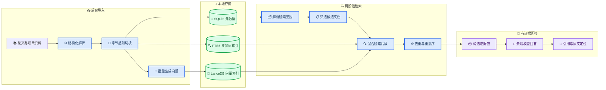

# Poppy 个人知识库实施方案（M4 16GB）

_面向 2026 年款 Apple M4、16GB 统一内存、256GB 存储设备的本地优先知识库设计，目标是在不过度占用资源的前提下实现类似 NotebookLM 的资料问答体验。_

---

## 🎯 目标与边界

Poppy 要从“在授权文件夹中搜索几个文本片段”升级为一个**全局个人知识库**：用户可以持续导入论文、Word、Excel、项目文档、代码和个人笔记，然后在全部资料、某个专题或某篇文档范围内提问，并获得带原文位置的回答。

第一版必须做到：

- 默认检索全部已授权且已索引的资料
- 支持 Notebook、项目、标签和单文档等可选范围
- 用中文检索英文论文或代码说明
- 文件新增、修改和删除后增量更新索引
- 回答显示来源、页码、章节和原文摘录
- 证据不足时明确说明没有找到，而不是补全猜测
- 索引在后台运行，不阻塞聊天和文献快问

第一版不做：

- 本地运行完整大语言模型
- 常驻 BGE-M3 和本地 0.6B Reranker
- 默认对所有 PDF 执行 OCR 或 Docling 深度解析
- 播客、自动视频、复杂思维导图等外围功能

NotebookLM 的核心交互也是选择来源、基于来源回答并用引用跳转回原文；Poppy 借鉴这个交互，但保留跨 Notebook 的“全部知识库”范围。[^1]

## 💻 设备约束与资源预算

本机基线为 Apple M4、10 核 CPU、16GB 统一内存。M4 包含可通过 Metal 使用的集成 GPU，但统一内存同时服务于 CPU、GPU、桌面应用和浏览器，因此不能让多个模型长期同时驻留。

| 项目 | 默认预算 | 控制方法 |
| --- | ---: | --- |
| Embedding 模型缓存 | ≤ 1.5GB | 默认只安装轻量模型 |
| 索引任务额外内存 | ≤ 4GB RSS | 单进程、批量 8～16、并发 1 |
| Poppy 总内存 | 目标 ≤ 6GB | 模型按需加载并自动释放 |
| 向量和元数据 | 100,000 片段目标 ≤ 2GB | 紧凑向量、清理旧版本 |
| 临时解析文件 | 任务完成即删除 | OCR 页面和中间图片不长期保存 |
| 最低可用磁盘 | 30GB | 低于阈值暂停大批量索引 |

这些数值是工程预算和验收上限，不是当前实现的实测结果。实施前后都要在目标设备上记录峰值内存、索引吞吐和检索延迟。

建议提供三个运行档位：

| 档位 | Embedding | 重排序 | 适用场景 |
| --- | --- | --- | --- |
| 节能 | 仅 FTS5 | 无 | 文件名、专有名词和快速定位 |
| 均衡（默认） | `multilingual-e5-small` | 规则＋云端模型可选 | 中英文论文和日常项目问答 |
| 高质量（手动） | `Qwen3-Embedding-0.6B` 量化版 | 前 20 条按需重排 | 复杂跨语言或代码检索 |

`multilingual-e5-small` 支持多语言语义表示，适合作为 16GB 设备的默认模型；Qwen3 Embedding 系列同时面向多语言、跨语言和代码检索，可作为可选质量档。[^2][^3]

## 🏗️ 目标架构

系统继续使用当前 Python sidecar 和 SQLite，不引入 Docker、独立数据库服务器或常驻本地大模型。SQLite 保存业务数据和 FTS5 全文索引，嵌入式 LanceDB 保存向量；LanceDB 支持本地文件数据库、向量检索、全文检索和混合查询，不需要启动单独服务。[^4] SQLite FTS5 继续负责 BM25 和关键词命中。[^5]



### 检索范围

检索范围不是“只能锁定一篇论文”，而是一个从宽到窄的筛选器：

1. 用户提到明确文件名时，优先精确或模糊匹配文件名
2. 用户选择当前项目或 Notebook 时，只在对应集合检索
3. 用户在内置阅读器中使用“全文问”时，优先当前文档
4. 其他普通对话默认使用全部知识库
5. UI 始终显示本轮实际使用的范围，并允许一键切换

### 两阶段检索

检索先找到候选文档，再在候选文档内部找片段，避免关键词相似的多篇论文占满上下文：

1. 使用标题、作者、年份、路径、标签、摘要和文档级向量选出 10～20 篇候选文档
2. 在候选文档内并行执行 FTS5 BM25 和多语言向量检索
3. 使用 RRF 合并结果，并按文档、章节和文本相似度去重
4. 对前 15～20 条候选执行规则或按需云端重排
5. 最终选择 6～10 条证据，并补充相邻片段和父章节摘要

关键词和语义检索互补，再对小规模候选进行重排序，能够在控制成本和延迟的同时提高结果精度。[^6][^7]

## 📚 文档解析与数据模型

### 默认解析路径

继续复用当前快速解析器，不把 Docling 直接打包进第一版：

- 文本型 PDF：`pypdfium2` / `pdfplumber`
- Word、PPT、Excel：`MarkItDown` 及当前解析路径
- Markdown、代码和纯文本：直接解析并保留路径、语言和符号信息
- 扫描 PDF：仅在文本提取失败时调用 macOS OCR
- 复杂表格、公式或阅读顺序异常：标记为“需要高质量解析”，以后按需接入 Docling

Docling 可以保留文档层级、表格、图片、公式和阅读顺序，但模型和依赖较重，因此应作为可选高质量插件，而不是每个文件的默认路径。[^8]

### 章节感知切块

每个片段目标为 350～700 tokens，重叠约 10%～15%，优先在标题、段落和列表边界切分。每个向量文本前附加精简上下文：

```text
文档：论文标题
元数据：作者、年份、文件名
章节：3.2 Memory Architecture
父级摘要：本节讨论分层记忆和淘汰策略
正文：当前片段内容
```

这种“为片段补充文档内上下文”的做法能减少片段脱离原文后产生的歧义。[^6]

### 最小数据表

| 数据表 | 关键字段 | 用途 |
| --- | --- | --- |
| `knowledge_spaces` | `id`, `name`, `kind` | 全部知识库、Notebook、项目 |
| `sources` | `id`, `path`, `hash`, `status` | 文件身份和索引状态 |
| `source_versions` | `source_id`, `hash`, `created_at` | 修改历史和回滚 |
| `documents` | `source_id`, `title`, `authors`, `year`, `summary` | 文档级检索 |
| `sections` | `document_id`, `heading`, `page_start` | 层级和父摘要 |
| `chunks` | `section_id`, `text`, `page`, `bbox` | 证据和全文索引 |
| `notes` | `source_id`, `quote`, `content` | 高亮、批注和保存回答 |
| `citations` | `answer_id`, `chunk_id`, `quote` | 回答与原文证据关系 |
| `index_jobs` | `source_id`, `stage`, `error` | 后台进度和失败原因 |

## ⚙️ 代码改造位置

| 位置 | 改造内容 |
| --- | --- |
| `poppy/features/document_extractors.py` | 输出带章节、页码、位置和类型的结构化块 |
| `poppy/features/semantic_embeddings.py` | 增加 `EmbeddingBackend`、懒加载、批量处理和模型版本 |
| `poppy/features/document_index.py` | 拆成文档级检索、片段级混合检索和证据判定 |
| `poppy/features/index_watcher.py` | 保留监听，接入持久化后台任务队列 |
| `poppy/storage/database.py` | 增加知识空间、版本、章节、笔记、引用和任务表 |
| `poppy/application/controller.py` | 解析范围、调用检索流水线并返回结构化引用 |
| `poppy/features/vector_store.py` | 新增 LanceDB 封装、批量写入和删除 |
| `poppy/features/retrieval_pipeline.py` | 新增候选文档、混合检索、去重、重排和证据打包 |
| `desktop/src/reader/PdfReader.tsx` | 点击引用后跳页并高亮原文位置 |
| `desktop/src/App.tsx` | 增加知识库范围、来源列表和引用状态 UI |

Embedding 记录必须保存 `model_id`、`dimension`、`content_hash` 和 `created_at`。模型切换后创建新索引版本，验证成功再原子替换旧索引，避免升级中断导致整个资料库不可用。

## ⚡ 后台索引与性能策略

文件监听只负责产生任务，实际解析和向量生成由单独后台 worker 执行：

1. 计算文件哈希；哈希未变化则跳过
2. 写入 `index_jobs` 并向 UI 报告阶段和进度
3. 快速解析文本并生成结构化章节
4. 按 8～16 条一批生成向量
5. 在临时索引中写入 FTS5 和 LanceDB
6. 完成后原子切换版本并删除旧片段
7. 失败时保留旧版本，并记录可读的失败原因

性能保护规则：

- 聊天或文献快问开始时，索引 worker 自动降为低优先级
- 内存压力达到警戒值时停止加载下一批，并释放 Embedding 模型
- 只允许一个解析或向量任务占用模型
- OCR 每次最多处理有限页数，并支持取消
- 退出 Poppy 时保存任务进度，下次继续而不是重新开始
- 定期清除临时页面、孤立向量和过期索引版本

## 🔗 回答与引用协议

模型不能只返回自由文本，必须返回回答和引用数组。建议的内部协议为：

```json
{
  "answer": "该论文将记忆分为…… [1]",
  "confidence": "supported",
  "citations": [
    {
      "source_id": "source-uuid",
      "document_id": "document-uuid",
      "chunk_id": "chunk-uuid",
      "title": "Paper title",
      "page": 7,
      "quote": "The memory hierarchy consists of...",
      "bbox": [72, 144, 520, 218]
    }
  ]
}
```

回答前执行以下校验：

- 引用的 `chunk_id` 必须来自本轮证据包
- 引用摘录必须能在片段原文中找到
- 核心结论至少有一个直接证据
- 多篇文档比较时，每个被比较对象都必须有证据
- 证据数量或相关度不足时返回 `insufficient_evidence`

桌面端把引用渲染为可点击标记，点击后打开内置 PDF 阅读器、跳到对应页并高亮 `bbox`。没有页面坐标的 Word、Excel 或代码文件则跳转到文件和章节/行号。

## 📋 分阶段实施

### 阶段 0：建立基准

- 准备 50～100 个真实问题，覆盖中文问英文论文、跨论文比较和项目问答
- 为每个问题标注正确文档、页码或代码文件
- 记录当前 Recall@20、引用正确率、P50/P95 检索延迟和内存峰值
- 增加只在调试模式显示的检索轨迹

### 阶段 1：轻量跨语言检索

- 实现 Embedding 后端接口和懒加载
- 接入 `multilingual-e5-small`
- 接入 LanceDB，并保留 SQLite FTS5
- 完成文档级＋片段级两阶段检索
- 实现哈希增量更新和模型版本迁移

### 阶段 2：知识库产品层

- 增加全部知识库、Notebook、项目和当前文档范围
- 增加来源选择、排除和当前范围提示
- 把高亮、笔记和保存回答作为可检索来源
- 显示后台索引进度、失败文件和失败原因

### 阶段 3：可信引用

- 输出结构化引用协议
- 点击引用跳转原文
- 增加引用一致性检查和证据不足拒答
- 增加多文档去重与来源多样性限制

### 阶段 4：可选质量增强

- 对复杂文档提供 Docling 高质量解析插件
- 提供 Qwen3 Embedding 量化质量档
- 根据实测结果决定是否引入本地 Reranker
- 增加多论文 Map-Reduce 总结和实验表格比较

## ✅ 验收标准

第一版完成必须同时满足：

- [ ] 中文问题能召回测试集中对应的英文论文
- [ ] 普通对话默认检索全部知识库，用户可看见并修改范围
- [ ] 指定文件名时优先命中正确文件，不与相似论文串文档
- [ ] 修改文件后只更新对应文档，不重建全部索引
- [ ] 后台索引期间聊天窗口仍可正常使用和停止回答
- [ ] 每个关键结论都有可点击的页码、章节或行号引用
- [ ] 引用摘录与原文一致，点击后能定位到来源
- [ ] 证据不足时明确拒答，不生成无来源结论
- [ ] 默认档索引额外内存不超过 4GB 预算
- [ ] 100,000 片段的热检索 P95 目标不超过 1.5 秒
- [ ] 关闭或重启 Poppy 不会损坏已有索引

检索质量不能只靠主观感受。至少跟踪 `Recall@20`、`MRR`、引用正确率、无依据回答率、检索延迟和索引峰值内存；达不到目标时保留旧检索器作为可回退路径。

## 🔐 隐私与故障回退

- 原文件、解析文本、向量和索引默认只保存在本机
- 只有最终选中的少量证据片段发送给云端回答模型
- UI 在请求前显示将要使用的来源数量，并支持排除敏感文档
- 日志不记录完整文档内容、API key 或飞书凭证
- 新索引构建失败时继续使用最后一个成功版本
- LanceDB 不可用时自动退回 SQLite FTS5，而不是阻止聊天
- Embedding 模型加载失败时切换“节能模式”并明确提示

## 🔗 References

[^1]: Google. (2026). “Use chat in NotebookLM.” _NotebookLM Help_. https://support.google.com/notebooklm/answer/16179559?hl=en

[^2]: Microsoft. (2024). “multilingual-e5-small.” _Hugging Face_. https://huggingface.co/intfloat/multilingual-e5-small

[^3]: Alibaba Cloud. (2025). “Qwen3-Embedding-0.6B.” _Hugging Face_. https://huggingface.co/Qwen/Qwen3-Embedding-0.6B

[^4]: LanceDB. (2026). “Hybrid Search.” _LanceDB Documentation_. https://docs.lancedb.com/search/hybrid-search

[^5]: SQLite. (2026). “SQLite FTS5 Extension.” _SQLite Documentation_. https://www.sqlite.org/fts5.html

[^6]: Anthropic. (2024). “Introducing Contextual Retrieval.” _Anthropic Engineering_. https://www.anthropic.com/engineering/contextual-retrieval

[^7]: Qdrant. (2026). “Reranking in Hybrid Search.” _Qdrant Documentation_. https://qdrant.tech/documentation/advanced-tutorials/reranking-hybrid-search/

[^8]: Docling Project. (2026). “Docling.” _GitHub_. https://github.com/docling-project/docling

---

_Last updated: 2026-07-17 · Target device: Apple M4 / 16GB unified memory / 256GB storage_

## 实施记录（2026-07-17）

MVP 已落地到 Poppy 桌面端：SQLite/FTS5 保存元数据和关键词索引，LanceDB 保存 384 维向量；`multilingual-e5-small` 采用量化 ONNX、懒加载和索引后释放。聊天可选择全部知识库、当前项目、Notebook 或单文档，回答携带结构化引用，PDF 引用可跳页并高亮匹配文字。文件监听、持久化索引任务、失败原因、版本记录、可检索摘录和低磁盘保护也已接通。

本机验收结果：

- 真实模型中文查询成功召回英文段落，查询向量和文档向量均为 384 维。
- 64 片段批量向量化约 0.744 秒，热查询向量约 1.7 毫秒，进程最大 RSS 约 700MB。
- 100,000 个 384 维合成片段的 LanceDB 热检索 P50 约 26.35 毫秒、P95 约 31.74 毫秒，基准进程最大 RSS 约 869MB。
- Python 全量测试 217 通过、1 跳过；桌面 TypeScript/Vite 构建、Rust `cargo check`、冻结 sidecar 跨语言检索和应用签名验证通过。

真实资料集的 Recall@20、MRR 和引用正确率需要用户提供 50～100 个带正确来源标注的问题后持续测量。仓库内提供 `scripts/evaluate_knowledge_retrieval.py` 作为评测入口，`scripts/benchmark_knowledge_vectors.py` 用于复现 10 万片段性能基准。
